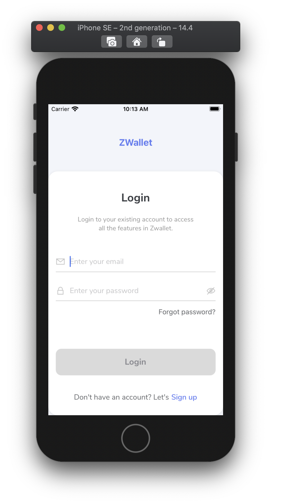
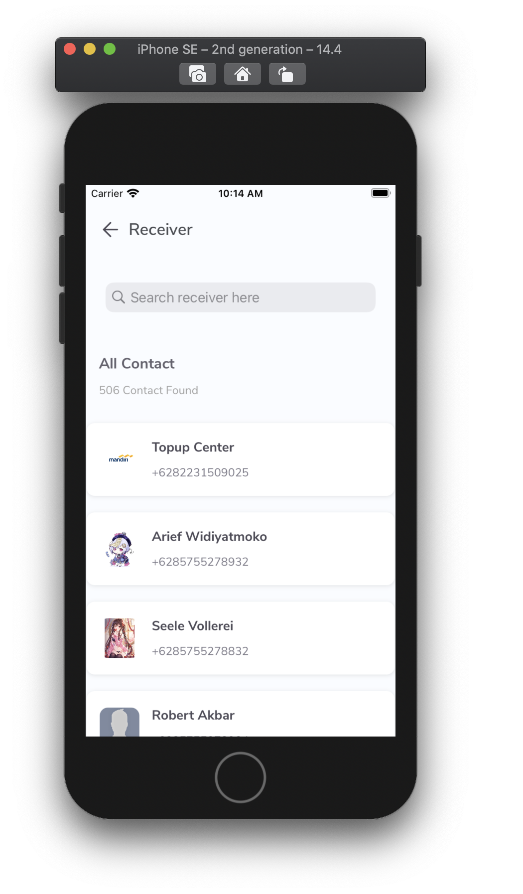

# ZWallet - iOS Swift with Viper Architecture
ZWallet is a mobile banking application designed for transactional activities. This application can make all transactions easier, faster, more practical, and safer
<p align="center">
  
</p>

## Tech in Use
- Swift 5 & Xcode 12.4
- JWT (JSON Web Token)
- VIPER
- Cocoapods

## Dependencies in Use
- Kingfisher
- Moya
- Netfox
- OTPFieldView
- NVActivityIndicatorView

## Screenshots
<p align="center">
  
  
  
</p>

## How To Install
1. Clone the repository using this command line in terminal
```$ git clone https://github.com/mkamilmistar/ZWallet-Viper.git```
2. Dependencies manager in this project using ```Cocoapods```, so you should install cocoapods first and run in terminal in the folder cloned 
```
$ cd App
$ pod install 
```
4. Last but not least, open ZWallet.xcworkspace using XCODE
5. RUN the project and you finally can use the project
